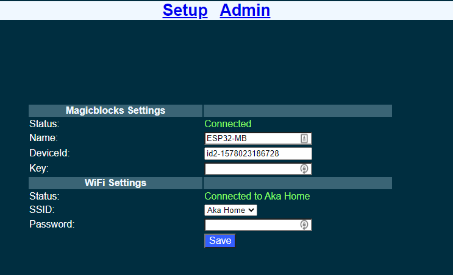

*********************
What is Magicblocks?
*********************

The Internet of things is nothing new. It is an evolutionary next step in the machine to machine communication paradigm. With an ever increasing number of 'things' at our disposal the need for connected 'things' has grown rapidly. However with increasing options comes added complexity which introduces steep learning curves and more importantly more confusion. What devices should I use? What cloud platform will best server my interest? I am new to IoT where should I start? Those are the question that would linger in any one who would dare to wonder in to the internet of Things. We, at magicblocks.io have put some magic to work to make the life of both the newcomer and the professional one step easier.

magicblocks.io is a launchpad for learning and prototyping your internet of things. It consists of

- Hardware suite made up of
		- Development boards
		- Prototyping kits for sensors & actuators
- Cloud platform made up of
		- Drag and drop editor to easily cook up your solutions
		- Dashboards to visualize your data
		- Data storage

Everything has been designed to make the learning curve as shallow as possible for the newcomer and as flexible as possible for the advanced user. 

**********************
Getting started
**********************

Setting up magicblocks
=======================

Sign Up & Login
---------------
- Visit `magicblocks.io <http://magicblocks.io>`_  and click signup at the top. 
- After filling the details and submitting you will get the activation link via email. Click on the link to activate the account. 
- Once done, you can login to your account from `magicblocks.io <http://magicblocks.io>`_ 

Start the Playground
---------------------

When you login for the first time your playground will not be running. Playground is the visual programming environment based on Node-Red that has been customized for seamless integration with hardware devices to enable IoT. If you do not have a valid subscription, you will be allowed to run the playground only for 1 hour continuously before it is automatically stopped. You will need to restart the playground manually after this 1 hour period

Create a new device
-------------------

Go to Device Manager and add a new generic ESP32 device

Keep this browser tab open since you will need to copy the device Id and the key to setup the device in the next step.

Setting up a device
====================

ESP32 based development boards
-------------------------------
- Install Arduino core for ESP32. Follow the instructions on `official arduino core for ESP3 <https://github.com/espressif/arduino-esp32>`_
- Clone the `ESP32-Magicblocks library <https://github.com/Magicblocks/ESP32-Magicblocks>`_ to your Arduino libraries folder
- Create a new project and past the code below in the .ino file:

	.. code-block:: c

		#include "ESP32_MB_Core.h"

		ESP32_MB_Core device;

		void setup(){
		  device.init();
		}

		void onCustomPayload(char* payload,int length){
		  Serial.println("Payload received!");
		  Serial.println(payload);
		}

		void loop(){
		  device.loop();
		}

This is the bare minimum sketch that should be uploaded for the device to connect to the platform

- Upload to your ESP32 board
- Reset the ESP32 board and wait for search for its configuration WiFi access point to come up. It would be named "ESP32-MB" in the default configuration
- Connect to this WiFi access point and go to http://192.168.4.1

- Fill in the device Id and the key that was generated in the previous step. You can change the **Name** to any name you like up to 32 characters. Select the WiFi SSID from the drop down and enter the WiFi password. If your WiFi is not listed here make sure the WiFi AP is active and reset the ESP32 board and retry.
- Save the configuration. The default admin password is 12345. You can change this from the **Admin** tab

 .. image:: Images/portal-admin.PNG

- Once saved, the ESP32 will restart and try to connect to the WiFi and then to magicblocks. You can connect to the ESP32's configuration WiFi AP and navigate to http://192.168.4.1 to check the status of the connection. 
- Login to magicblocks, navigate to **Device Manager** and check if the **Connection** column comes up as a blinking green indicator. If yes, you can proceed to the next step

Go to the playground!
=======================

- Login to magicblocks and click on **Edit** to open the playground.

- The playground is a hosted instance of a customized version of the open source Node-Red application. On the left you will find the palette where all the blocks will reside. You can drag and drop the blocks from the palette to the canvas and start rolling very quickly. Once done click the **Deploy** button on the top right corner and all your changes will be saved. In the next section we will go through some examples covering all the relevant blocks

